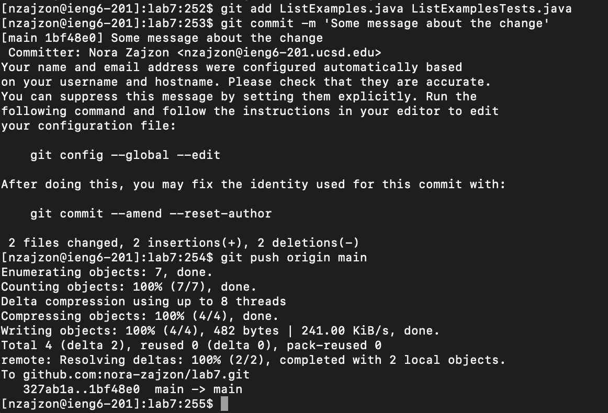

# Lab 4 

## Logging into ieng6 (step 4)

Keys pressed: `ssh nzajzon@ieng6.ucsd.edu<ENTER>`

## Creating a clone (step 5)

> I had previously cloned this

Keys pressed since link was in my clipboard: `git clone<Command-V><ENTER>`
  Assuming I did not copy paste url keys pressed: `git clone git@github.com:ucsd-cse15l-s23/lab7.git<ENTER>`

## Running the Tests (step 6)

Keys pressed (used tab to finish name of directory): `cd l<tab><ENTER>sh test.sh<ENTER>`
  Equal to: `cd lab7/<ENTER>sh test.sh<ENTER>`

## Editing the file (Step 7 Part 1)

Keys pressed (used tab to finish name of directory): `vim L<tab>.java<ENTER>`
  Keys pressed: `vim ListExample.java<ENTER>`

## Editing the file (Step 7 Part 2)

Keys pressed: `33j13lxi2:wq!<ENTER>`

The line I needed to edit was 33 lines down from the top and 13 spaces over to the right. I then deleted the 1, inerted a 2, saved the file, 
and quit the vim editor.

## Editing the file (Step 8)

Keys pressed (2 commands up in my history, I ran `sh test.sh`): `<UP><UP><ENTER>`
  Equal to: `sh test.sh<ENTER>`

## Committing Changes (Step 9)

> Accidental changes in ListExamplesTests.java (2 deleted spaces) were committed but not needed

Keys pressed (I copy pasted command for git commit): `git add ListExamples.java<ENTER><Command-V><ENTER>git push origin main<ENTER>`
  Keys pressed: `git add ListExamples.java <ENTER> git commit -m 'Some message about the change'<ENTER> git push origin main<ENTER>`
