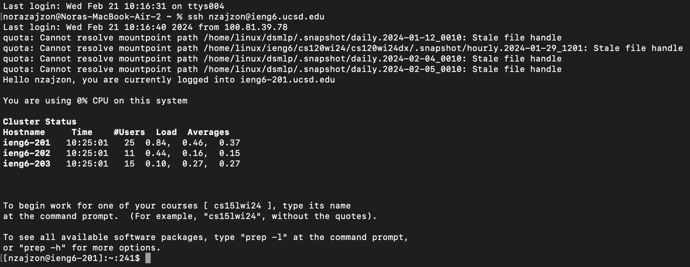
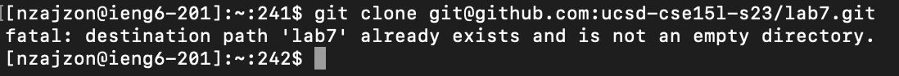
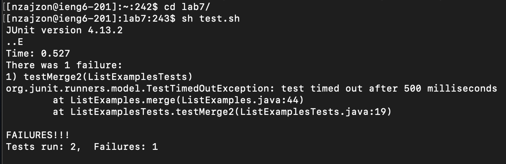
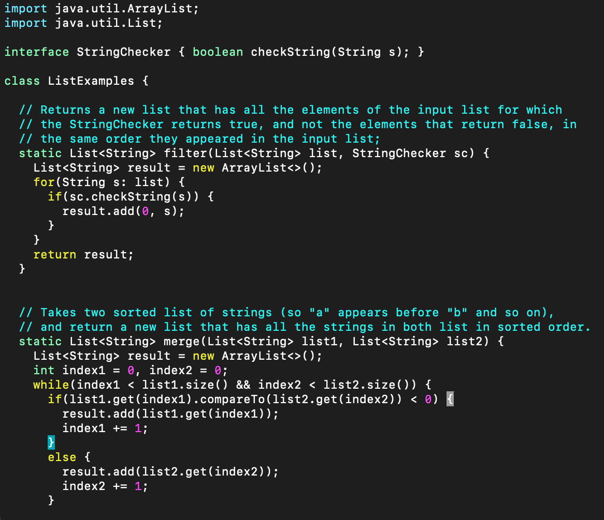
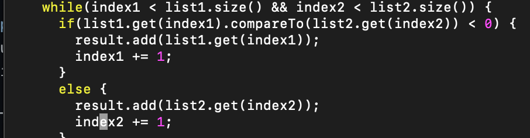
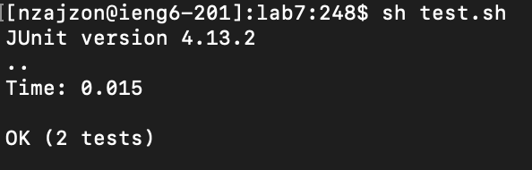
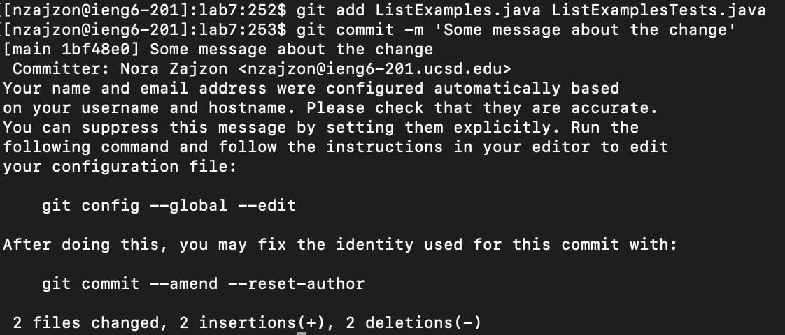

# Lab 4 

## Logging into ieng6 (step 4)

Keys pressed: ssh nzajzon@ieng6.ucsd.edu `<ENTER>`

## Creating a clone (step 5)

> I had previously cloned this

Keys pressed: git clone git@github.com:ucsd-cse15l-s23/lab7.git `<ENTER>`

## Running the Tests (step 6)

Keys pressed: cd lab7/ `<ENTER>` sh test.sh `<ENTER>`

## Editing the file (Step 7 Part 1)

Keys pressed: vim ListExample.java `<ENTER>`

## Editing the file (Step 7 Part 2)

Keys pressed: 33j13lxi2:wq!`<ENTER>`

## Editing the file (Step 8)

Keys pressed: `<UP>``<UP>`

## Committing Changes (Step 9)

> Accidental changes in ListExamplesTests.java were committed but not needed

Keys pressed: git add ListExamples.java `<ENTER>` git commit -m 'Some message about the change' `<ENTER>`
